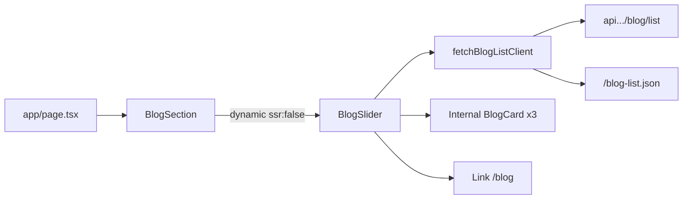

# Homepage Blog Section — Shareable Agent Handoff

Copy this entire file into a chat with your other Cursor agent. Attach a screenshot of the section if you have one (dark city night background, 3 blog cards, yellow badges, View More CTA).

---

## Goal

Recreate the **homepage blog section** from Traveling Partner:

- Dark full-bleed night-city background
- Heading: **Our blogs and *news.*** (italic yellow gradient on “news.”)
- Custom 3-card carousel (1 large + 2 side on desktop; 1 card on mobile)
- Yellow category badges, author initials / date / read time
- Pagination dots + active-post excerpt under the cards
- Yellow **View More** pill CTA → `/blog`

**Source stack:** Next.js App Router + React + Tailwind + Framer Motion + `next/image`.  
Adapt to the target project’s stack if different, but keep layout, tokens, and behavior.

---

## Source files to mirror (Traveling Partner repo)

| Role | Path |
|------|------|
| Home page composition | `app/page.tsx` — mounts `<BlogSection />` between About and Safety |
| Section shell (bg, title, dynamic import) | `components/Home-sections/BlogSection.tsx` |
| Carousel + cards + CTA (**main UI**) | `components/BlogSlider.tsx` |
| Loading spinner | `components/loader.tsx` (or any spinner) |
| List fetch (client) | `lib/blogClientFetch.ts` |
| List extract / IDs | `lib/blogApi.ts` (`extractBlogList`, `getBlogIdFromItem`) |
| Date / category helpers | `lib/blogFormat.ts` (`formatBlogDate`, `pickBlogCategoryField`) |
| Cloudinary URL transform | `lib/cloudinaryImage.ts` |
| API base URL helpers | `lib/websiteApiUrl.ts` |
| Background image | `public/images/blog-section-bg.png` |

**Do not reuse for visual parity:** `components/Blog-sections/BlogCard.tsx` (listing page only). Home cards live **inside** `BlogSlider.tsx`.

---

## Architecture



- `BlogSection` / `BlogSlider` take **no props**
- Data loads **client-side** in `useEffect`
- Carousel is **custom Framer Motion** (not Embla / Swiper)

---

## Data contract

**Primary API:** `https://api.traveling-partner.com/api/website/blog/list`  
**Fallback:** same-origin `/blog-list.json` (build-time snapshot)

### List payload shapes accepted

```ts
{ data: { content: Item[] } }  // preferred Spring-style
// also: { data: Item[] }, Item[], { data: { blogs: [] } }, etc.
```

### Mapped item used by the slider

```ts
interface Blog {
  id: string | number;
  cover_image: string;
  main_title: string;
  description1: string;
  date?: unknown;
  category?: string;
  author?: string;
  readTime?: string; // display string from API — not computed
}
```

### Field aliases when mapping

| Field | Accepts |
|-------|---------|
| id | `id \| blog_id \| blogId \| website_blog_id \| websiteBlogId` |
| image | `coverImage \| cover_image \| image` |
| title | `mainTitle \| main_title \| title` |
| excerpt | `description1 \| description \| short_description` |
| date | `date \| publishedAt \| published_at` |
| category | `categoryName \| category \| type \| blogType \| blog_type` |
| author | `author` |
| readTime | `readTime \| read_time` |

**Filter:** keep items with `id && main_title`.  
**Card link:** `/blog/detail?id=${id}`  
**View More:** `/blog`

### Optional mock JSON (if no API)

```json
[
  {
    "id": "1",
    "cover_image": "https://example.com/cover-1.jpg",
    "main_title": "Top Safety Tips Every Passenger Should Follow When Booking a Ride",
    "description1": "Stay safe and enjoy a comfortable journey with these essential ride-booking safety tips for passengers.",
    "date": "2026-05-27",
    "category": "Partner Guide",
    "author": "Traveling Partner",
    "readTime": "8 min"
  },
  {
    "id": "2",
    "cover_image": "https://example.com/cover-2.jpg",
    "main_title": "How Travelling Partner Makes City-to-City Travel Easier and More Affordable",
    "description1": "Travelling between cities in Pakistan can be expensive and inconvenient.",
    "date": "2026-06-04",
    "category": "Travel Guide",
    "author": "ADMIN ONE",
    "readTime": "5 min"
  },
  {
    "id": "3",
    "cover_image": "https://example.com/cover-3.jpg",
    "main_title": "How Travelling Partner Makes Intercity Travel Easier and More Affordable",
    "description1": "Learn how Travelling Partner is helping passengers travel between cities.",
    "date": "2026-05-26",
    "category": "Growth Guide",
    "author": "Traveling Partner",
    "readTime": "5 min"
  }
]
```

---

## Layout and design tokens

### Section shell (`BlogSection`)

- Padding: `py-[72px] sm:py-[88px] lg:py-[104px]`
- Content: `max-w-7xl px-4 sm:px-6 lg:px-8`
- Background: `blog-section-bg.png` cover + `#0b0b0b/70` overlay + warm radial `rgba(253,184,19,0.08)`
- H2: white Poppins `clamp(2rem,4.2vw,3.5rem)` font-bold
- Accent “news.”: italic gradient `#fce001` → `#fdb813` (`bg-clip-text text-transparent`)

### Carousel geometry (`BlogSlider`)

```ts
DESIGN_SCALE = 0.76
MAX_FRAME_SCALE = 1.1
ACTIVE_W = Math.round(600 * DESIGN_SCALE)   // ≈ 456
ACTIVE_H = Math.round(558 * DESIGN_SCALE)   // ≈ 424
SIDE_W = Math.round(440 * DESIGN_SCALE)     // ≈ 334
CARD_GAP = Math.round(25 * DESIGN_SCALE)    // ≈ 19
IMAGE_H = Math.round(306 * DESIGN_SCALE)    // ≈ 233
CARD_RADIUS = Math.round(25.43 * DESIGN_SCALE) // ≈ 19
VIEWPORT_W = ACTIVE_W + CARD_GAP + SIDE_W + CARD_GAP + SIDE_W
COMPACT_BREAKPOINT = 768
AUTOPLAY_MS = 4500
SLIDE_SPRING = { type: "spring", stiffness: 300, damping: 30, mass: 0.85 }
```

- **Desktop (≥768):** 3 visible cards — active (larger) + 2 side; viewport scales to container (`frameScale` up to `1.1`)
- **Mobile (&lt;768):** 1 full-width card; image `aspect-[5/3]`

### Card chrome

- Fill: `#161616` + slight white overlay (`linear-gradient(rgba(255,255,255,0.03), …), #161616`)
- Inset border `rgba(255,255,255,0.06)`; deeper shadow when active
- Category badge: `#fce001` bg, black uppercase, `rounded-[6px]`, top-left on image
- Title: white bold; excerpt: light grey / white/70
- Author: yellow circle + initials; calendar + clock icons; date via `formatBlogDate` (`en-US` long, e.g. `May 27, 2026`); read time as API string
- Meta separators: 3px dots, `text-white/50`
- Dots: active `h-2 w-9 bg-[#fce001]`; inactive `h-2 w-2 bg-white/25`
- View More: yellow gradient pill (`from-[#fce001] to-[#fdb813]`), black label, black circle with white `→`

---

## Behavior

- Autoplay every **4.5s**; pause on hover; ~650ms lock during slide
- Dots navigate only (no prev/next arrows)
- Desktop: `AnimatePresence mode="popLayout"` + layout spring
- Mobile: `mode="wait"` fade/slide
- Active excerpt under dots animates with blur / x
- Section fades up with Framer Motion `whileInView`

---

## Images

1. Only use `src` if it starts with `/`, `http://`, or `https://` (else skip / no placeholder on home cards)
2. Cloudinary URLs: inject `f_auto,q_72,w_900,c_limit,dpr_auto` via `optimizeCloudinaryImage`
3. `next/image` with `fill` + `object-cover`; bottom fade gradient into `#161616`
4. Allow CDN host in Next image config (`res.cloudinary.com` in source; source also uses `images.unoptimized: true`)

---

## Dependencies

**Required:** `next`, `react`, `react-dom`, `framer-motion`, Tailwind, Poppins (or equivalent).

**Not required for this section:** Embla, react-slick, GSAP, date-fns (home uses native `toLocaleDateString` via `formatBlogDate`).

---

## Minimal recreate checklist

1. Port `BlogSection.tsx` + `BlogSlider.tsx` (keep internal `BlogCard` inside the slider).
2. Port fetch/normalize helpers (`blogClientFetch`, `blogApi` list extract + id, `blogFormat` date/category, `cloudinaryImage`) **or** stub with mock JSON matching the `Blog` shape above.
3. Add night-city background (`public/images/blog-section-bg.png` or equivalent).
4. Brand yellows `#fce001` / `#fdb813`, dark card `#161616`, Poppins.
5. Mount on home; wire card → detail route and View More → blog index.
6. Match visual: 3-up desktop carousel, yellow badges, dots + excerpt + View More row.

---

## Key implementation notes from source

### Homepage mount (`app/page.tsx`)

```tsx
import BlogSection from "@/components/Home-sections/BlogSection";
// ...
<AboutUsSection />
<BlogSection />
<SafetySecuritySection />
```

### Dynamic client-only slider (`BlogSection.tsx`)

```tsx
const BlogSlider = dynamic(() => import("../BlogSlider"), {
  ssr: false,
  loading: () => (
    <div className="flex justify-center items-center py-20">
      <div className="animate-spin rounded-full h-12 w-12 border-b-2 border-[#fce001]" />
    </div>
  ),
});
```

### Map API item → Blog (`BlogSlider.tsx`)

```ts
const mapBlog = (item: Record<string, unknown>): Blog => ({
  id: getBlogIdFromItem(item),
  cover_image: String(item?.coverImage ?? item?.cover_image ?? item?.image ?? "").trim(),
  main_title: String(item?.mainTitle ?? item?.main_title ?? item?.title ?? "").trim(),
  description1: String(item?.description1 ?? item?.description ?? item?.short_description ?? "").trim(),
  date: item?.date ?? item?.publishedAt ?? item?.published_at ?? "",
  category: pickBlogCategoryField(item),
  author: String(item?.author ?? "").trim(),
  readTime: String(item?.readTime ?? item?.read_time ?? "").trim(),
});
```

### Client fetch order (`blogClientFetch.ts`)

1. Production API URL(s) from `websiteApiUrlsForBrowser("/blog/list")`
2. Fallback `/blog-list.json`

---

## What success looks like

- Section matches the dark city-night blog carousel on Traveling Partner home
- Desktop shows 3 cards with one visually dominant “active” card
- Mobile shows one card at a time
- Autoplay + dots work; View More goes to the blog listing
- Cards link to blog detail by id
